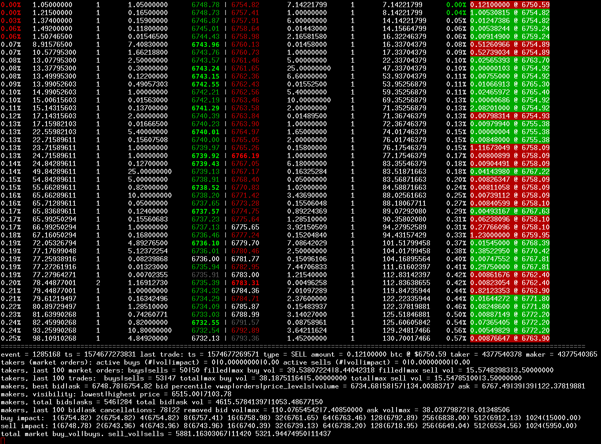

Limit Order Book
================

### Warning
Very rough code, thrown together very quickly in order to study limit order book dynamics/market microstructure. 
It is so rough in fact, that I will probably re-code it. Much of the mess is the result of various issues encountered
along the way, most notably:

- Missing data: bitstamp's event stream frequently omits data which results in complicated order life-cycle management.
- Unordered data: data frequently appears out of order. For example, a cancel event followed by an add event.

Besides the code, the tool does however work and is quite usable.

<p align="center">
  
</p>

### Overview
This is an implementation of a [Limit Order Book](http://en.wikipedia.org/wiki/Order_book_(trading)). It has 2 modes of operation: 1) It
continuously reads from a stream of buy/sell order events (new order, modify order, cancel order) to produce a diabolical ascii chart of
order book depth along with time and sales. 2) It can re-construct an order book from archived order book events. In both cases, a log
file is kept from which 225 indicators can be extracted into a csv file with the supplied script (see running instructions). The intention
of this project was simply to derive this .csv file for use elsewhere, hence the mess. I intend it to be a starting point for something 
better.

I do not have access to Level 2 quotes for a traditional [ECN](http://en.wikipedia.org/wiki/Electronic_communication_network) (typically 
this is very expensive due to the sheer volume of data and the potential advantage it can provide). So this implementation is based on 
data from Bitcoin exchanges, specifically streaming data via a websocket from Bitstamp. New (planned) implementation will abstract this
away to a higher level protocol, FIX protocol?.

## Building
Project uses maven. issue the following to build a stand-alone jar:

```bash
git clone https://github.com/phil8192/ticker
cd ticker; mvn clean install; cd ..
git clone https://github.com/phil8192/bitstamp-ws
cd bitstamp-ws; mvn clean install; cd ..
git clone https://github.com/phil8192/limit-order-book
cd limit-order-book; mvn clean compile assembly:single
```
## Running
This has only ever been run on a 1920x1200 display; will fix this later. For now, change the font size so it fits. Ensure java is installed,
then to consume from bitstamp's live orders stream:

```
./ob.sh true btcusd 2>/dev/null # real time (continuous scroll)
./ob.sh false btcusd 2>/dev/null # update screen once per second.
./ob.sh true 1>/dev/null 2>state.log # save ob state to a log file.
```

To later parse this log file into a csv, use the `parse_ob.sh` script:

```bash
./parse_ob.sh state.log ob.csv
``` 

(details/use of this .csv will be discussed in another project). head -1 the resulting .csv file to see the (hopefully) self descriptive 
header/field names:

```
event,ts,last_trade_ts,last_trade_price,last_trade_volume,last_trade_buy_or_sell,last_trade_taker,last_trade_maker,active_buys,active_sells,outstanding_buy_volume,outstanding_sell_volume,buy_impact,sell_impact,last_100_mo_buys,last_100_mo_buy_volume,last_100_mo_buy_max_volume,last_100_mo_sell_volume,last_100_mo_sell_max_volume,last_100_trade_buys,last_100_trade_buy_volume,last_100_trade_buy_trade_max,last_100_trade_sell_volume,last_100_trade_sell_max_volume,best_bid_price,best_bid_volume,best_ask_price,best_ask_volume,bid_percentile_vwap_1,bid_percentile_orders_1,bid_percentile_priceLevel_1,bid_percentile_volume_1,bid_percentile_vwap_2,bid_percentile_orders_2,bid_percentile_priceLevel_2,bid_percentile_volume_2,bid_percentile_vwap_3,bid_percentile_orders_3,bid_percentile_priceLevel_3,bid_percentile_volume_3,bid_percentile_vwap_4,bid_percentile_orders_4,bid_percentile_priceLevel_4,bid_percentile_volume_4,bid_percentile_vwap_5,bid_percentile_orders_5,bid_percentile_priceLevel_5,bid_percentile_volume_5,bid_percentile_vwap_6,bid_percentile_orders_6,bid_percentile_priceLevel_6,bid_percentile_volume_6,bid_percentile_vwap_7,bid_percentile_orders_7,bid_percentile_priceLevel_7,bid_percentile_volume_7,bid_percentile_vwap_8,bid_percentile_orders_8,bid_percentile_priceLevel_8,bid_percentile_volume_8,bid_percentile_vwap_9,bid_percentile_orders_9,bid_percentile_priceLevel_9,bid_percentile_volume_9,bid_percentile_vwap_10,bid_percentile_orders_10,bid_percentile_priceLevel_10,bid_percentile_volume_10,bid_percentile_vwap_11,bid_percentile_orders_11,bid_percentile_priceLevel_11,bid_percentile_volume_11,bid_percentile_vwap_12,bid_percentile_orders_12,bid_percentile_priceLevel_12,bid_percentile_volume_12,bid_percentile_vwap_13,bid_percentile_orders_13,bid_percentile_priceLevel_13,bid_percentile_volume_13,bid_percentile_vwap_14,bid_percentile_orders_14,bid_percentile_priceLevel_14,bid_percentile_volume_14,bid_percentile_vwap_15,bid_percentile_orders_15,bid_percentile_priceLevel_15,bid_percentile_volume_15,bid_percentile_vwap_16,bid_percentile_orders_16,bid_percentile_priceLevel_16,bid_percentile_volume_16,bid_percentile_vwap_17,bid_percentile_orders_17,bid_percentile_priceLevel_17,bid_percentile_volume_17,bid_percentile_vwap_18,bid_percentile_orders_18,bid_percentile_priceLevel_18,bid_percentile_volume_18,bid_percentile_vwap_19,bid_percentile_orders_19,bid_percentile_priceLevel_19,bid_percentile_volume_19,bid_percentile_vwap_20,bid_percentile_orders_20,bid_percentile_priceLevel_20,bid_percentile_volume_20,ask_percentile_vwap_1,ask_percentile_orders_1,ask_percentile_priceLevel_1,ask_percentile_volume_1,ask_percentile_vwap_2,ask_percentile_orders_2,ask_percentile_priceLevel_2,ask_percentile_volume_2,ask_percentile_vwap_3,ask_percentile_orders_3,ask_percentile_priceLevel_3,ask_percentile_volume_3,ask_percentile_vwap_4,ask_percentile_orders_4,ask_percentile_priceLevel_4,ask_percentile_volume_4,ask_percentile_vwap_5,ask_percentile_orders_5,ask_percentile_priceLevel_5,ask_percentile_volume_5,ask_percentile_vwap_6,ask_percentile_orders_6,ask_percentile_priceLevel_6,ask_percentile_volume_6,ask_percentile_vwap_7,ask_percentile_orders_7,ask_percentile_priceLevel_7,ask_percentile_volume_7,ask_percentile_vwap_8,ask_percentile_orders_8,ask_percentile_priceLevel_8,ask_percentile_volume_8,ask_percentile_vwap_9,ask_percentile_orders_9,ask_percentile_priceLevel_9,ask_percentile_volume_9,ask_percentile_vwap_10,ask_percentile_orders_10,ask_percentile_priceLevel_10,ask_percentile_volume_10,ask_percentile_vwap_11,ask_percentile_orders_11,ask_percentile_priceLevel_11,ask_percentile_volume_11,ask_percentile_vwap_12,ask_percentile_orders_12,ask_percentile_priceLevel_12,ask_percentile_volume_12,ask_percentile_vwap_13,ask_percentile_orders_13,ask_percentile_priceLevel_13,ask_percentile_volume_13,ask_percentile_vwap_14,ask_percentile_orders_14,ask_percentile_priceLevel_14,ask_percentile_volume_14,ask_percentile_vwap_15,ask_percentile_orders_15,ask_percentile_priceLevel_15,ask_percentile_volume_15,ask_percentile_vwap_16,ask_percentile_orders_16,ask_percentile_priceLevel_16,ask_percentile_volume_16,ask_percentile_vwap_17,ask_percentile_orders_17,ask_percentile_priceLevel_17,ask_percentile_volume_17,ask_percentile_vwap_18,ask_percentile_orders_18,ask_percentile_priceLevel_18,ask_percentile_volume_18,ask_percentile_vwap_19,ask_percentile_orders_19,ask_percentile_priceLevel_19,ask_percentile_volume_19,ask_percentile_vwap_20,ask_percentile_orders_20,ask_percentile_priceLevel_20,ask_percentile_volume_20,lowest_price,highest_price,total_bids,total_asks,total_bid_volume,total_ask_volume,last_100_cancelled_bids,last_100_cancelled_bid_volume,last_100_cancelled_bid_max_volume,last_100_cancelled_ask_volume,last_100_cancelled_ask_max_volume,total_mo_buy_vol,total_mo_buy,total_mo_sell_vol,total_mo_sell,b1,b2,b4,b8,b16,b32,b64,b128,b256,b512,b1024,s1,s2,s4,s8,s16,s32,s64,s128,s256,s512,s1024
```

## Order book
Divided into 2 sections, the left hand side of the book shows the depth of BUY limit orders (bids), while the right hand side shows the
depth of SELL (asks) limit orders. At the top of bid side of the book on the left is the current best bid, while the top of the ask side
of the book is the current best ask. Each row is a price level, decreasing/increasing for the bid/ask side respectively. Each level consists
of 5 columns: The percentage difference from the best bid/ask (the depth), the cumulative sum of volume/liquidity up until and including 
the price level, the number of orders enqueued at this price level, the amount of volume/liquidity available at this individual price level,
and finally, the actual price of this this level. For example, on the bid side, and entry of: 0.42%, 157.40063272, 1, 59.68000000, 656.26,
indicates that this price level is 0.42% less than the current best bid, 157.4 units of volume would need to be sold before this level is
reached, there is 1 order at this level (to buy 59.68 units) @ 656.26 dollars. 

## Time and sales
Trades are shown on the right hand side, in the third column. The purpose of this implementation is to reconstruct/infer trades given a 
stream of bid/ask limit order events. These trades are the result of this inference: showing the trade direction (BUY = a buy market order
hit an ask limit order) (SELL = a sell market order hit a bid limit order). The implementation can sometimes match makers to takers: A maker
is an order to buy/sell placed at a price limit _in_ the order book - i.e., the trader is providing liquidity, whereas a taker is an order
to buy/sell that will not be placed in the order book (it will consume maker orders until it is filled) - the trader is said to be removing
liquidity. As such they pay the price: the market spread. 


## Order book indicators

### Last trade
```
event = 260 ts = 1402055269918 last trade: ts = 1402055221468 type = SELL amount = 0.85900000 btc @ $655.21 taker = 26538640 maker = 26538633
```

Shows the last "event" number, unix timestamp, last trade timestamp, last trade type (in this case SELL), amount (volume) price (dollars).
The order book also tries to match takers (market orders) with makers (limit orders). In this case, the taker (id = 26538640) initiated an
order that crossed the book (marketable limit order), "lifting" / "hitting" an limit order to buy (id = 26538633) resulting in a trade.


### Current trade
```
takers (market orders): active buys (#|vol|impact) = 0|0.00000000|0.00 active sells (#|vol|impact) = 1|1.01560000|658.04
```

The current active order(s) executing in the order book. Normally, it would be pointless to display this information since a venue would
execute an order immediately. On Bitstamp (the exchange this code is tested on), orders can take seconds (and in some cases minutes) to
lift matches from the book. As such, this line displays orders executing in real-time: In this example, there is currently an order to SELL
1 unit of bitcoin, which crosses the best bid on the buy side of the book, resulting in a trade. Given the volume of the sell order
(liquidity taker), the "market impact" is calculated as the cumulative sum of volume at different levels in the other side of the book
until the order would be filled. With very large orders, it is possible to see what the price will be very far into the future since orders
take so long to execute.

### Last 100 market orders
```
takers, last 100 market orders: buys|sells = 21|79 filled|max buy vol = 14.47491430|4.15620349 filled|max sell vol = 2.19343486|0.99870000 
```

This indicator measures the sum of buy or sell liquidity removing orders (market orders) and the sum of buy/sell removed volume for the last
100 orders. This quantity represents the actual buying/selling pressure -ie what traders are actually _doing_. It represents orders from
"impatient" traders who "demand liquidity" and are willing to pay the bid/ask spread to have their order executed immediately rather than
placing a limit order. In this example. there have been 79 > 21 sell orders, although of those orders, there has been 2.19 > 0.99 executed
volume. As such, an indicator derived from these values may perhaps be better based on the Volume Weighted Average number of market orders. 

### Last 100 lifted orders
```
takers, last 100 trades:  buys|sells = 43|57 total|max buy vol = 19.54130529|3.94220349 total|max sell vol = 3.37220977|0.99870000
```

A similar quantity to market orders, except this is a measurement of "lifted" resting orders on either side of the book. (A single
market order can remove a number of resting orders in the order book until it's volume has been filled or it's limit hit.

### Percentile order book imbalance
```
makers, best bid|ask = 658.16|658.49 bid percentile vwap|orders|price_levels|volume = 656.81|13|13|29.17825870 ask = 658.80|7|6|55.84985648
```

Based on the well known observation that most of the "price action" occurs at the best bid/ask (decreasing up/downwards), this indicator
is a measurement of the current best bid/ask price, the Volume Weighted Average Price, the number of orders, the number of price levels and
the sum of volume +- 0.5% from the current best bid/ask. The VWAP is the average price weighted by the amount of volume available up until
+- 0.5% from the best bid/ask in the order book. Based on the idea that greater liquidity closer to the best bid/ask reflects higher "desperation",
this can be used as static order book imbalance indicator. The number of orders and and volume are simply the sum of orders/volume respectively
within the percentile either side of the book. The price_levels value is an indication of "density", that is, for +- 1 dollar, there are 100
possible price levels for 1 cent ticks. A value of 100 would mean maximum density, while 0 would mean there are no orders within 1 dollar of
the best bid/ask. Within such a small range from the best bid/ask, a high density may indicate a great willingness to buy/sell as traders place
orders in front of each other (placing an order at an existing price level will result in that order being queued FIFO style behind older orders
at that level.)

### Visibility
```
makers, visibility: lowest|highest price = 655.30|662.00
```

This is the min/max bid/ask price observed since starting the order book. This can be used to determine completeness of information: The 
order book is not initialised with any existing orders and is instead will contain new orders initiated > the time the order book was started.
That is, levels below < lowest and > highest, may be incomplete - The time an order rests in the order book is related to the distance
from the current best bid/ask.

### Total order book size. 
```
makers, total bids|asks = 173|79 total bid|ask vol = 1186.33384374|435.02934535
```

This quantity reflects the total number of bid/ask orders/volume on either side of the book. E.g., bid vol/ask < 1 towards 0 would mean that
the order book is heavier on the ask side (regardless of price level). It is better to derive an indicator from these values that takes into
account the dynamic relationship between them as opposed to considering a single, static ratio.

### Last 100 cancellations
```
makers, last 100 bid|ask cancellations: 74|26 removed bid vol|max = 1001.07368793|72.00000000 ask vol|max = 218.74924673|36.00000000
```

This quantity reflects the last 100 limit order cancellations. In this example, from the last 100 cancellations, 74 orders summing to 1001 in volume,
of which the largest individual cancellation was 72 in volume occurred on the buy side of the book. Cancellations occur when a trader wishes to
re-position an order (closer of further away) from the best bid/ask. This can be interpreted in a number of ways - cancellations could indicate
growing "impatience", if the orders are re-positioned closer to the market, or, as a sign of manipulation: walking other traders into the book
by placing an attractive bid/ask then removing it suddenly such that a subsequent order hits the order a level above/below, quote stuffing,
laddering, false price levels etc. For example, a large order at a particular level may be falsely lead other traders to believe there
is lots of liquidity at that level, which may be interpreted as support/resistance, where in fact is is possible that the order will be quickly 
removed should the market price approach it. Note also that cancellations could also be a reaction to some external event -E.g., anticipation
of a downturn/upturn to avoid "adverse selection" - where an order could have been executed at a better price.

### Market impact
```
buy impact:  1(661.99) 2(661.99) 4(661.99) 8(662.00) 16(662.00) 32(662.00) 64(662.50) 128(663.65) 256(664.98) 512(757.00) 1024(757.00)
sell impact: 1(660.00) 2(660.00) 4(660.00) 8(659.01) 16(659.00) 32(659.00) 64(657.19) 128(656.25) 256(655.71) 512(653.66) 1024(619.75)
``` 

This is a measure of liquidity on either side of the book. When a market order arrives, it will be filled by lifting existing limit orders in
the book. For example, if the bid side of the book contains 3 limit orders for 1 unit of volume each at price levels 10,20,30 dollars respectively,
where 30 is the best bid, and an order to SELL 2 units arrives, the 2 limit orders 30, then 20 will be removed/lifted/hit, such that the best
bid becomes 10 after the trade. The market impact for this trade of 2 units was -20 dollars. This summary provides a quick guide as to the
potential impact of fat-fingers in steps of 1,2,4,8,...,1024 units of volume (2^1 : 2^10). In this example, the best bid would end up as
619.75 dollars from 666 dollars should a trader dump 1024 units of volume on the market.

### Total activity
```
total market buy_vol|buys. sell_vol|sells = 538.93429764|205 190.87452149|195
```

This is simply a count of the number of buy/sell market orders since order book initiation. 


## Issues
- The current trade information active buy/sells (#|vol|impact) sometimes remains static (it should only be populated while trades are being
executed. This is due to the fact that the bitstmap feed sometimes omits order events.

- Sometimes the time and sales data may contain duplicates. This sometimes occurs with Bitstamp's market order emulation initiated from their
trading UI (instant order). This is because an order placed in this way will be re-positioned (cancel,add) every second at the current best bid/ask
until the order has been filled. It is difficult to determine the trade direction in this case. (All orders appear as limit orders)

